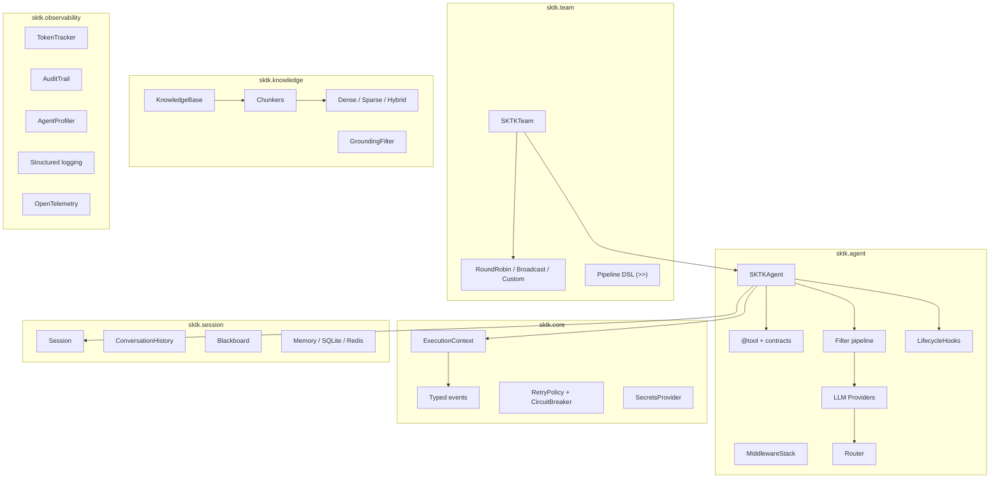
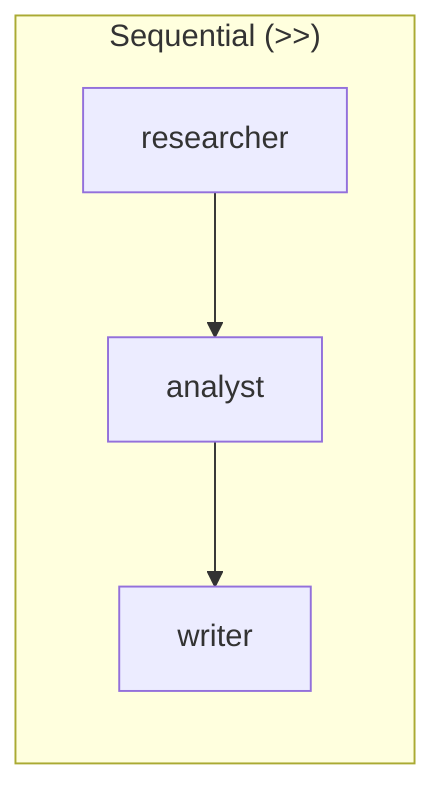
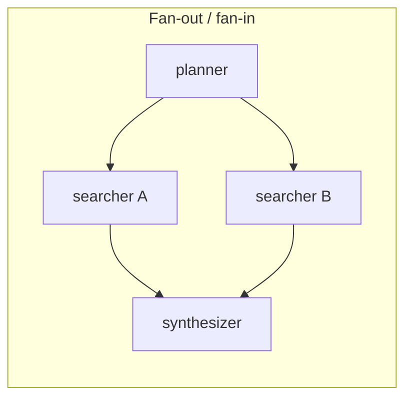
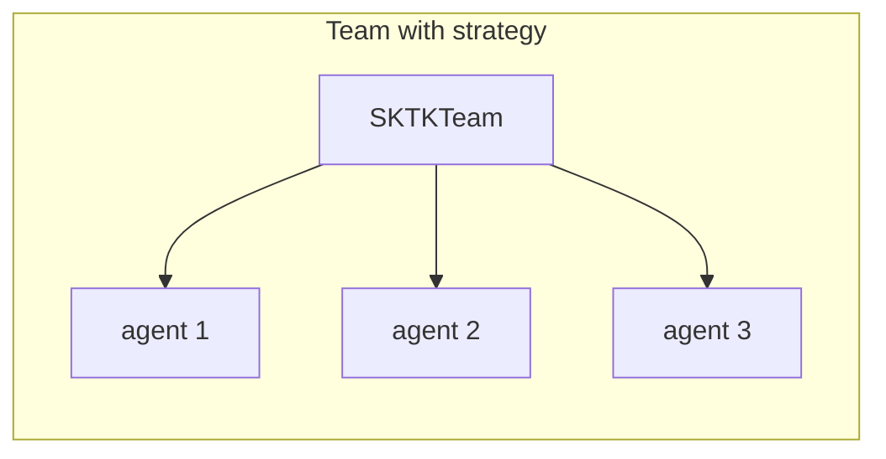
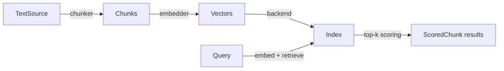

# sktk

A production-grade convenience layer over [Semantic Kernel](https://github.com/microsoft/semantic-kernel) for Python. Reduces the boilerplate of building LLM agent systems.

- **One-line agents** — create, invoke, and test agents with minimal setup
- **Swappable LLM backends** — Anthropic Claude, Azure OpenAI, Gemini, or local models behind a unified protocol
- **Guardrail pipeline** — PII filtering, prompt injection detection, content safety, token budgets, and rate limiting out of the box
- **Persistent sessions** — conversation history and typed blackboard with in-memory, SQLite, or Redis backends
- **Multi-agent orchestration** — teams, pipelines (`>>`), fan-out/fan-in, supervisor/worker, reflection, and debate patterns
- **RAG built in** — chunking, dense/sparse/hybrid retrieval, FAISS and HNSW backends, grounding filters
- **Observability** — token tracking with cost attribution, tamper-evident audit trails, profiling, OpenTelemetry tracing, token quotas
- **Test without LLM calls** — `MockKernel`, scripted responses, plugin sandbox, prompt regression suites

## Install

```bash
pip install -e .
```

With extras:

```bash
pip install -e ".[redis,rag-faiss,dev]"
```

Requires Python 3.11+.

## Checkpoint configuration

`CheckpointStore` supports a config-first workflow via `CheckpointConfig`:

```python
from sktk.team.checkpoint import CheckpointConfig, CheckpointStore

cfg = CheckpointConfig(
    backend="sqlite",
    path="checkpoints.db",
    max_checkpoints=1000,
    max_workflows=1000,
    max_state_bytes=256_000,
    allow_overwrite=False,
    shared_max_workers=4,
    retry_attempts=2,
    retry_delay=0.01,
    retry_backoff=2.0,
    retry_jitter=0.01,
)
store = CheckpointStore.from_config(cfg)
```

Notes:
- `allow_overwrite=False` prevents clobbering existing non-SQLite files.
- `max_state_bytes` and `max_workflows` cap memory usage.
- `metrics_hook` can be used to collect structured events without affecting core flow.
- Set `freeze_registry=True` to prevent runtime backend registry mutation.
- Set `allow_plugin_loading=False` to disable entry-point discovery.
- Set `metrics_async=True` to emit metrics on a background dispatcher.

### Backend plugins

You can provide custom checkpoint backends via Python entry points:

```toml
[project.entry-points."sktk.checkpoint_backends"]
my_backend = "my_pkg.checkpoints:factory"
```

The factory should accept a `CheckpointConfig` and return an object that implements
`CheckpointBackend` (async `save/load/list/clear/close`). Plugin-specific settings
should be read from `CheckpointConfig.backend_options`.

To declare plugin compatibility, set a version attribute on your factory:

```python
def factory(cfg):
    ...
factory.__sktk_checkpoint_api__ = "1.0"
```

At runtime, plugins are discovered lazily when a backend name isn’t found. You can
force discovery with:

```python
from sktk.team.checkpoint import load_backend_plugins
load_backend_plugins()
```

### OpenTelemetry tracing

If you have OpenTelemetry installed and initialized via `sktk.observability.tracing.instrument()`,
you can enable spans for checkpoint operations:

```python
from sktk.observability.tracing import instrument
from sktk.team.checkpoint import CheckpointConfig, CheckpointStore

instrument()
cfg = CheckpointConfig(trace_enabled=True, trace_span_prefix="sktk.checkpoint")
store = CheckpointStore.from_config(cfg)
```

### OpenTelemetry metrics

To export checkpoint metrics via OTEL, use the metrics hook:

```python
from sktk.observability.otel_metrics import instrument_metrics, make_metrics_hook
from sktk.team.checkpoint import CheckpointConfig, CheckpointStore

instrument_metrics()
cfg = CheckpointConfig(metrics_hook=make_metrics_hook())
store = CheckpointStore.from_config(cfg)
```

## Quick start

```python
import asyncio
from sktk import SKTKAgent

async def main():
    agent = SKTKAgent(
        name="assistant",
        instructions="Be concise.",
        _service=provider,  # AnthropicClaudeProvider, AzureOpenAIProvider, etc.
    )
    result = await agent.invoke("What is Python?")
    print(result)

asyncio.run(main())
```

For testing without a live LLM:

```python
agent = SKTKAgent.with_responses("bot", ["Hello!", "Goodbye!"])
result = await agent.invoke("Hi")  # returns "Hello!"
```

## Architecture



## Package overview

| Package | What it does |
|---------|-------------|
| `sktk.agent` | Agent abstraction, `@tool` decorator, typed contracts, filter pipeline, lifecycle hooks, middleware, approval gates, permissions, rate limiting, task planner, prompt templates |
| `sktk.agent.providers` | Swappable LLM backends (Anthropic Claude, Azure OpenAI, Gemini, local) with a registry/factory pattern |
| `sktk.agent.router` | Provider router with latency, cost, A/B, and fallback selection policies |
| `sktk.core` | Execution context propagation, typed event dataclasses, exception hierarchy, retry/circuit-breaker, pluggable secrets management, configuration |
| `sktk.knowledge` | RAG pipeline: text sources, fixed-size and sentence chunkers, BM25 sparse index, dense/hybrid retrieval with reciprocal rank fusion, optional FAISS and HNSW backends, grounding filters with token budgets |
| `sktk.session` | Conversation history and typed blackboard with pluggable backends (in-memory, SQLite, Redis), conversation summarization strategies |
| `sktk.team` | Multi-agent orchestration with `SKTKTeam`, composable strategies (round-robin, broadcast, capability-based), pipeline topology DSL with `>>` operator and Mermaid visualization |
| `sktk.observability` | Token tracking with cost attribution, tamper-evident audit trails, performance profiling, structured context-aware logging, OpenTelemetry instrumentation, token quotas |
| `sktk.testing` | `MockKernel` for scripted responses, `PluginSandbox` for isolated tool testing, `PromptSuite` for prompt regression, assertion helpers, pytest fixtures |

## Guardrail filters

Filters run at three stages -- input, output, and function call -- and can allow, deny, or modify content:

| Filter | Stage | Purpose |
|--------|-------|---------|
| `PromptInjectionFilter` | input | Detects instruction overrides, role reassignment, system prompt extraction |
| `PIIFilter` | input + output | Blocks emails, SSNs, phone numbers via regex |
| `ContentSafetyFilter` | input + output | Configurable blocked-pattern matching |
| `TokenBudgetFilter` | input | Rejects prompts exceeding a token budget |
| `PermissionPolicy` | function_call | Allowlist/denylist for tool invocations |
| `RateLimitPolicy` | input | Time-window call throttling with async locking |
| `AutoApprovalFilter` | function_call | Auto-approve safe tools, gate sensitive ones for human approval |
| `GroundingFilter` | input | Auto-inject RAG context from a `KnowledgeBase` |
| `TokenQuotaFilter` | input + output | Per-user/session token consumption limits |

## LLM providers

SKTK uses a protocol-based provider abstraction. The framework ships with:

| Provider | Backend |
|----------|---------|
| `AnthropicClaudeProvider` | Anthropic Messages API |
| `AzureOpenAIProvider` | Azure OpenAI Chat Completions |
| `GeminiProvider` | Google Gemini |
| `LocalLLMProvider` | Any local model exposing a `chat()` coroutine |

All providers return a normalized `CompletionResult` with text, token usage, and metadata. Register custom providers via `ProviderRegistry`.

## Multi-agent orchestration







Five built-in patterns demonstrated in [`examples/concepts/multi_agent/patterns/`](examples/concepts/multi_agent/patterns/README.md): sequential pipeline, parallel fan-out/fan-in, supervisor/worker, reflection loop, and debate/consensus.

## RAG pipeline



Three retrieval modes: `DENSE` (cosine similarity), `SPARSE` (BM25), `HYBRID` (reciprocal rank fusion). Optional FAISS and HNSW backends for production-scale vector search.

## Observability

| Component | What it tracks |
|-----------|---------------|
| `TokenTracker` | Per-invocation token usage with cost attribution via `PricingModel` |
| `AuditTrail` | Tamper-evident hash-chained audit entries with query and integrity verification |
| `AgentProfiler` | Wall-clock timing breakdown per labeled section |
| `SessionRecorder` | Full session replay recording |
| `EventStream` | Pluggable event sinks for structured logging integration |
| `TokenQuota` | Per-user/session token consumption limits and enforcement |
| `instrument()` | OpenTelemetry span creation for distributed tracing |

## Resilience

| Pattern | What it does |
|---------|-------------|
| `RetryPolicy` | Exponential backoff with configurable jitter strategy |
| `CircuitBreaker` | Tracks failures, trips open at threshold, half-open recovery with async locking |

## Session management

| Backend | Persistence | Use case |
|---------|-------------|----------|
| `InMemoryHistory` | None | Tests, short-lived conversations |
| `SQLiteHistory` | Disk | Single-node, development |
| `RedisHistory` | Network | Multi-node production |

Sessions include a typed `Blackboard` for cross-agent state sharing with put/get/scan/delete operations and pattern-based key lookup.

## Examples

See [`examples/README.md`](examples/README.md) for the full learning path with 24 runnable examples.

Quick start order:

| Step | File | Focus |
|------|------|-------|
| 1 | [`01_basic_agent.py`](examples/getting_started/01_basic_agent.py) | Create and invoke an agent |
| 2 | [`02_persistent_session.py`](examples/getting_started/02_persistent_session.py) | SQLite session persistence |
| 3 | [`03_tools_and_contracts.py`](examples/getting_started/03_tools_and_contracts.py) | Tool registration, typed output contracts |
| 4 | [`04_lifecycle_hooks.py`](examples/getting_started/04_lifecycle_hooks.py) | Lifecycle hooks, middleware wrapping |

Most examples call the real Claude API. Set `ANTHROPIC_API_KEY` in a `.env` file at the project root. A few examples (session, resilience, knowledge, testing) run offline without an API key.

## Testing

```bash
pip install -e ".[dev]"
pytest
```

750+ tests, 95% coverage target. The testing toolkit provides:

- `MockKernel` / `with_responses()` for deterministic agent testing without LLM calls
- `PluginSandbox` for isolated tool function testing
- `PromptSuite` for prompt regression testing in CI
- `assert_history_contains()`, `assert_events_emitted()`, `assert_blackboard_has()` helpers

## Project structure

```
src/sktk/
  agent/         # Agent, tools, filters, hooks, middleware, providers, router
  core/          # Context, events, errors, types, resilience, secrets, config
  knowledge/     # RAG: chunking, retrieval, grounding, backends (memory, FAISS, HNSW)
  session/       # History, blackboard, backends (memory, SQLite, Redis)
  team/          # Multi-agent strategies, topology DSL, capability routing
  observability/ # Metrics, audit, profiling, logging, tracing, quotas
  testing/       # Mocks, assertions, fixtures, sandbox
tests/
  unit/          # 710+ tests mirroring src/ structure
  integration/   # Provider and router integration tests
  e2e/           # End-to-end workflow tests
examples/
  getting_started/   # Numbered walkthrough
  concepts/          # Agent, multi-agent, knowledge, session, resilience, observability, testing
docs/
  api/           # API reference (one file per package)
  ops/           # Operations playbooks
  policies/      # Versioning and migration policy
benchmarks/      # Runtime baselines and SLO gates
```

## Docs

- API reference: [`docs/api/`](docs/api/index.md)
- Versioning policy: [`docs/policies/versioning.md`](docs/policies/versioning.md)
- Operations playbooks: [`docs/ops/README.md`](docs/ops/README.md)
- Contributing: [`CONTRIBUTING.md`](CONTRIBUTING.md)
- Changelog: [`CHANGELOG.md`](CHANGELOG.md)

## Benchmarks

Runtime baselines live in [`benchmarks/`](benchmarks/README.md).

## License

[MIT](LICENSE)
